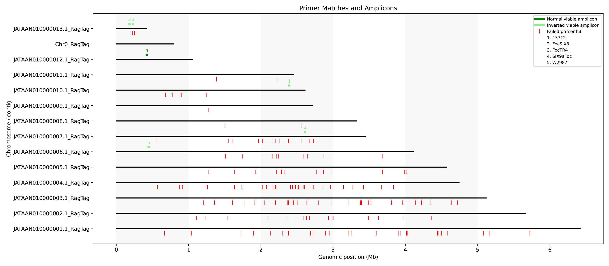

# Primer BLAST Filter & Amplicon Visualizer

This tool parses BLAST results of primer pairs against genome assemblies, identifies viable amplicons, and generates tabular and graphical outputs. It is designed for researchers validating primer specificity and distribution across genomes.

---

## 🔧 Installation (Conda Environment)

Clone the repo:

```bash
git clone https://github.com/YourUser/primer-blast-filter.git
cd primer-blast-filter
```

Create a Conda environment:

```bash
conda create -n primerfilter python=3.10 biopython matplotlib
conda activate primerfilter
```

Optionally install BLAST if you want to run it from the same environment:

```bash
conda install -c bioconda blast
```

---

## 📑 Input Files

### 1. Primer FASTA (`primer.fasta`)
Contains primer sequences in FASTA format. Primer IDs must end in `F` or `R` to mark forward/reverse orientation.

Example:
```
>MyGeneF
ATGCGTACGTTAGC
>MyGeneR
CGTACGACTTACGA
```

### 2. Genome FASTA (`genome.fasta`)
Reference genome(s) to test primers against.

### 3. BLAST Results (`blast.tsv`)
Tabular BLAST output (format 6 + sstrand + sseq).  
Run like this:

```bash
makeblastdb -in genome.fasta -dbtype nucl
blastn -query primer.fasta -db genome.fasta \
       -outfmt "6 qseqid sseqid sstart send sstrand pident length mismatch gapopen evalue bitscore sseq" \
       -out blast.tsv
```

---

## ▶️ Usage

```bash
python primer_filter.py \
  --primers primer.fasta \
  --blast blast.tsv \
  --genome genome.fasta \
  --out_prefix results \
  --min_len 80 \
  --max_len 3000 \
  --tick_units Mb \
  --tick_step 1
```

---

## 📂 Outputs

- `results_amplicons.tsv` → Viable amplicons with sequences, mismatches, % identity, orientation.
- `results_failed.tsv` → Primer hits that failed filters (with reasons).
- `results_plot.pdf` → Visual representation:
  - Black bar = chromosome
  - Green bar = viable amplicon (dark = normal, light = inverted)
  - Red tick = failed primer hit
  - Numbered labels tied to primer names in legend
 


---

## ⚙️ Parameters

### Required
- `--primers` : Primer FASTA file.
- `--blast` : BLAST results (format 6 + sstrand + sseq).
- `--genome` : Genome FASTA file.

### General
- `--out_prefix` : Prefix for output files (default `results`).

### Filtering
- `--min_len` : Minimum allowed amplicon length (default: 80 bp).
- `--max_len` : Maximum allowed amplicon length (default: 3000 bp).
- `--require_3p` : Number of 3′ bp that must match exactly (default: 3).
- `--max_mismatches` : Max mismatches allowed in primer hits (default: 10).
- `--min_pident` : Minimum % identity required (default: 0.0).
- `--len_tolerance` : Allowable difference (± bp) between primer length and BLAST hit length (default: 5).
- `--min_fail_len_frac` : Fraction of primer length required for a failed hit to be reported (default: 0.8).
- `--min_fail_pident` : Minimum % identity required for failed hits to be reported (default: 70.0).

### Plotting
- `--tick_units` : Units for x-axis ticks (`bp`, `kb`, `Mb`, `Gb`) (default: Mb).
- `--tick_step` : Spacing between ticks in chosen units (default: 1.0).

---

## 📊 Example Run

```bash
python primer_filter.py \
  --primers primer.fasta \
  --blast blast.tsv \
  --genome genome.fasta \
  --min_len 100 \
  --max_len 2000 \
  --tick_units kb \
  --tick_step 100
```

---

## 🔬 Features
- Handles **normal** and **inverted primer orientation**.
- Filters **partial alignments** (keeps only hits ~full primer length).
- Exports **amplicons** and **failed hits** separately.
- Publication-ready **PDF plots** with scaled chromosome axes.
- Configurable **axis units** (bp / kb / Mb / Gb) and tick spacing.
- Annotated legends mapping primers → numbers.

---

## 📖 Citation
Conrad R. (2025). BLAST_primer_filter. GitHub repository. Available at: https://github.com/rotheconrad/BLAST_primer_filter

